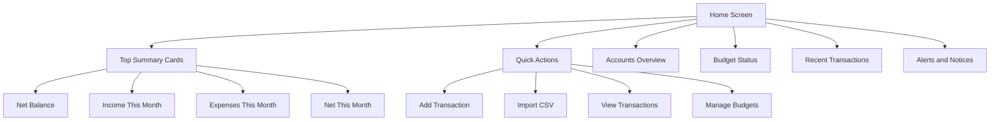
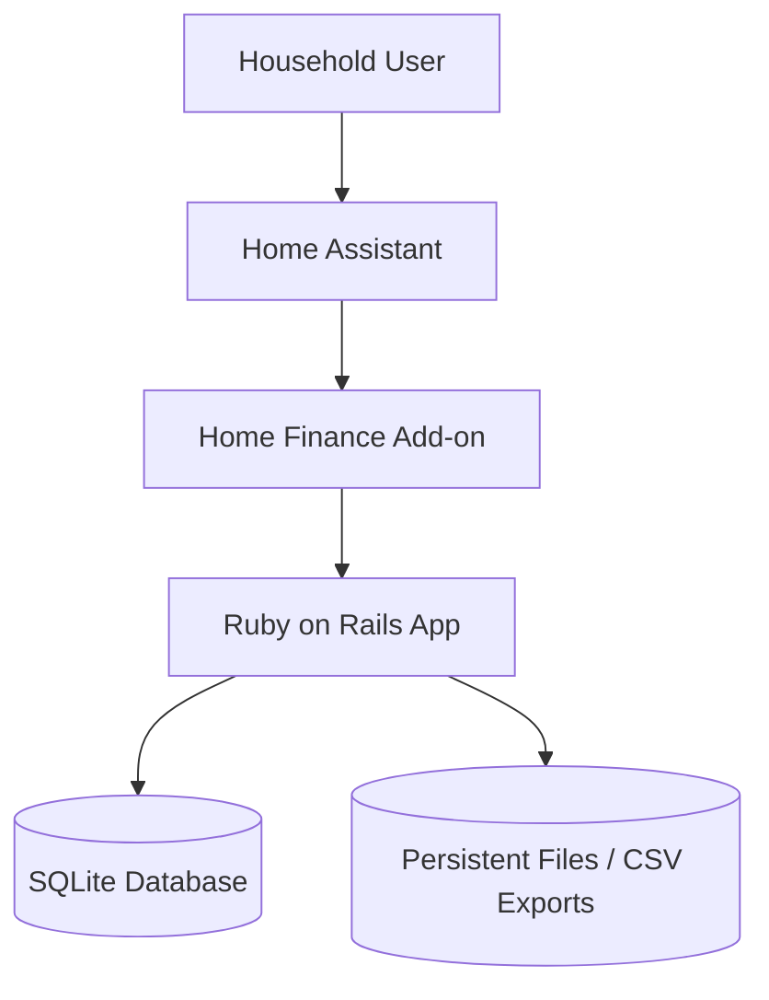
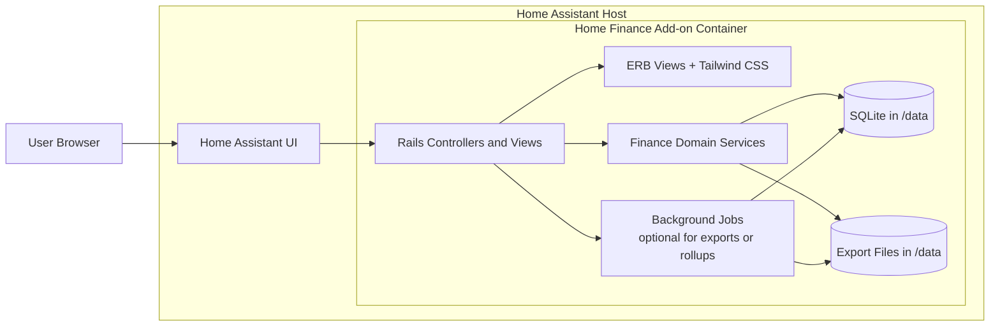
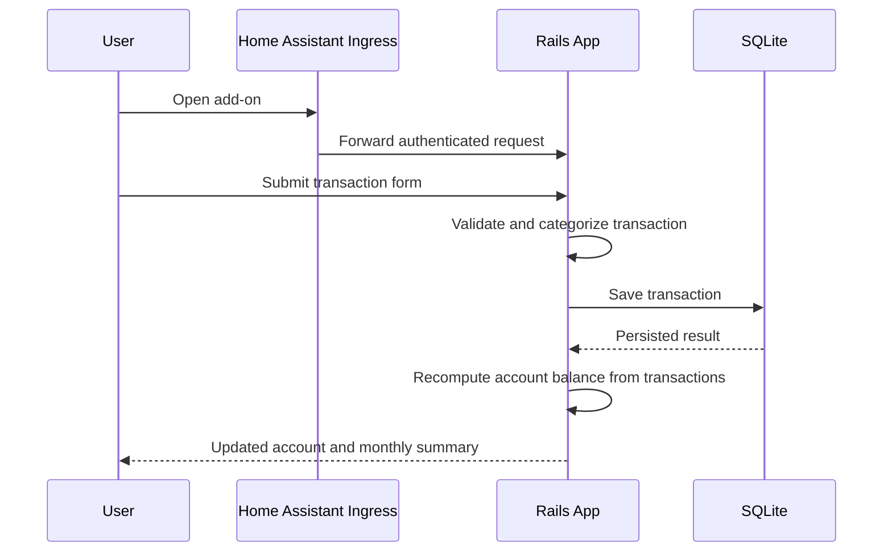
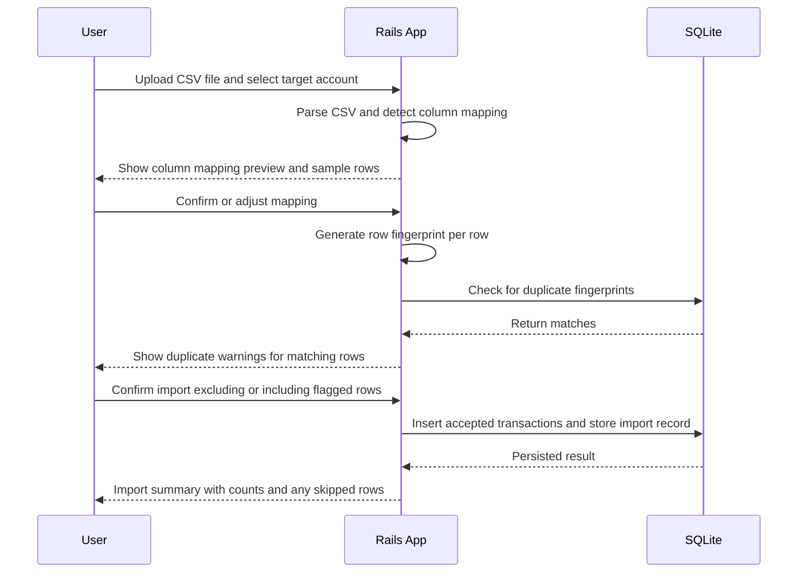

# Home Finance App Plan

## Goal

Build a simple home finance application for a single household. The app will run as a Ruby on Rails application packaged as a Home Assistant add-on, with a small operational footprint and minimal setup.

## Scope

The first version should focus on recording money movement clearly and producing a useful monthly view.

## Simple Requirements

### Functional Requirements

1. Users can create and manage accounts such as cash, checking, credit card, and savings.
2. Users can record income, expenses, and transfers between accounts.
3. Users can assign a category to each transaction.
4. Users can add optional notes and transaction dates.
5. Users can view current balances per account.
6. Users can see a monthly summary of income, expenses, and net balance.
7. Users can filter transactions by date range, account, and category.
8. Users can define a simple monthly budget per category.
9. Users can compare actual spending against the monthly budget.
10. Users can import transactions automatically from CSV files using automatic column mapping.
11. Transactions should have idempotency alert if the same transaction is imported twice, based on amount, date, account, and a row fingerprint derived from all mapped columns.
12. Users can export transactions to CSV.
13. The system should track CSV import history so the user can review past imports and their status.

### Non-Functional Requirements

1. The app should be easy to install and run inside Home Assistant as an add-on.
2. The app should work well for a single home or small family.
3. The app should use persistent storage so data survives restarts and upgrades.
4. The app should stay lean, with minimal external dependencies.
5. The UI should be simple, mobile-friendly, and usable from Home Assistant ingress.
6. The system should support basic authentication through Home Assistant add-on access boundaries.
7. The system should be easy to back up as part of Home Assistant backups.

### Basic UI Requirements

1. The app should provide a clean dashboard with account balances, monthly income, monthly expenses, and net result.
2. The main navigation should expose Dashboard, Transactions, Accounts, Categories, Budgets, and Import/Export.
3. Transaction lists should be presented in a readable table on desktop and stacked cards on small screens.
4. Forms should use clear labels, inline validation messages, and sensible default values for common actions.
5. Income, expense, and transfer entries should be visually distinct through badges, color, or icons.
6. Budget status should be easy to scan, using simple progress bars or status indicators.
7. CSV import screens should show file status, detected columns, preview rows, and duplicate warnings before confirmation.
8. The visual design should use Tailwind CSS with a consistent spacing, typography, and color system.

### Basic UX Requirements

1. A user should be able to add a new transaction in as few steps as possible.
2. The most common actions, such as adding a transaction or importing a CSV, should be reachable within one or two clicks from the dashboard.
3. The interface should prioritize readability over density, especially for balances, dates, and amounts.
4. The app should give immediate feedback for successful saves, failed imports, and duplicate transaction warnings.
5. Destructive actions such as deleting transactions or accounts should require confirmation.
6. Filtering and search should persist while the user reviews transaction lists, so context is not lost.
7. Mobile use should be treated as a first-class case because the app may be accessed through Home Assistant on phones or tablets.
8. Empty states should guide the user toward the next action, such as creating an account or importing the first CSV file.

## Home Screen Plan

### Purpose

The home screen should act as the financial summary page for the household. It should answer these questions immediately:

1. How much money is available right now?
2. How much came in and went out this month?
3. Which categories are driving spending?
4. Are any budgets at risk?
5. What happened recently?

### Home Screen Sections

1. Top summary cards
  - Net balance across all accounts
  - Total income this month
  - Total expenses this month
  - Net result this month
2. Accounts overview
  - List of accounts with current balance
  - Simple visual cue for account type such as cash, bank, or credit
3. Budget status
  - Categories closest to or over budget
  - Percentage used for each visible budget
4. Recent transactions
  - Last 5 to 10 transactions
  - Date, category, account, amount, and type
5. Quick actions
  - Add transaction
  - Import CSV
  - View all transactions
  - Manage budgets
6. Alerts and notices
  - Duplicate import warnings
  - Missing category mappings
  - Budget overrun alerts

### Home Screen Data Summary

The home screen should summarize these data points:

- Total balance across active accounts
- Current month income total
- Current month expense total
- Current month net total
- Number of transactions this month
- Top spending categories for the current month
- Budgets over threshold, such as above 80 percent used
- Most recent imported file status or last import date

### Home Screen Layout Guidance

Desktop layout:

- First row: four summary cards
- Second row: account balances and budget status side by side
- Third row: recent transactions full width
- Sticky or prominent quick action area near the top

Mobile layout:

- Summary cards stacked vertically
- Quick actions shown directly under summary cards
- Accounts, budgets, and recent transactions shown as separate card sections
- Recent transactions shown as compact list items instead of a full table

### Home Screen UX Notes

1. The most important numbers should appear above the fold.
2. Negative values and overspent budgets should be visually obvious.
3. The screen should load in a useful state even when there is little or no data.
4. Each summary block should provide a clear path to the related detailed page.
5. The home screen should avoid deep analytics in the MVP and focus on immediate household visibility.

### Home Screen Mermaid Wireframe

## Suggested MVP Boundaries

Include in MVP:

- Account management
- Transaction entry and listing
- Categories
- Monthly dashboard
- Basic budgets
- CSV import with duplicate detection
- CSV export
- Docker packaging and Home Assistant add-on shell

Leave for later:

- Bank integrations
- Receipt scanning
- Multi-currency support
- Investment tracking
- Recurring transaction automation
- Advanced forecasting

## Basic System Architecture

### Architecture Decisions

1. Use Ruby on Rails 8 with Ruby 3.3 or later as a monolithic application.
2. Use server-rendered Rails views with Hotwire (Turbo and Stimulus) for lightweight interactivity such as inline form feedback, flash messages, and partial page updates without a full SPA.
3. Use Tailwind CSS for a lean, consistent, mobile-friendly UI without adding a heavy frontend framework.
4. Use SQLite for the first version to reduce operational complexity.
5. Store the SQLite database and exported files in the Home Assistant add-on persistent data directory.
6. Package the Rails app in a Docker container following Home Assistant add-on conventions.
7. Expose the app through Home Assistant ingress instead of a separate public endpoint.
8. Configure Rails to operate under a dynamic subpath using `RAILS_RELATIVE_URL_ROOT` so that all routes, assets, and redirects work correctly behind the Home Assistant ingress proxy.
9. Compute account balances on the fly from transactions and opening balance rather than storing a mutable balance column, to avoid data drift between the balance field and actual transaction history.

### Main Components

- Rails Web App: handles UI, business rules, reports, CSV import, and CSV export.
- Tailwind CSS Layer: provides utility-based styling for server-rendered Rails views.
- SQLite Database: stores accounts, transactions, categories, budgets, and settings.
- Home Assistant Add-on Wrapper: provides container packaging, ingress, configuration, and persistent storage.
- Persistent Volume: stores the database and exported files under the add-on data path.

## Mermaid Diagrams

### 1. Context Diagram

### 2. Container and Component Diagram

### 3. Transaction Flow

### 4. CSV Import Flow

### 5. Transfer Between Accounts

A transfer creates two linked transaction records: an expense from the source account and an income to the destination account, sharing a common `transfer_pair_id`. Both records are saved in a single database transaction to keep balances consistent.

## High-Level Data Model

Core entities:

- Account
  - name
  - type (cash, checking, credit_card, savings)
  - opening_balance
  - active (boolean)
- Transaction
  - account_id
  - kind: income, expense, transfer
  - amount (always stored as a positive value; kind determines direction)
  - transaction_date
  - category_id
  - note (optional)
  - transfer_pair_id (optional, shared UUID linking the two sides of a transfer)
  - import_id (optional, references the CsvImport that created this record)
  - fingerprint (optional, hash for duplicate detection on imported rows)
- Category
  - name
  - kind: income or expense
- Budget
  - category_id
  - year
  - month (1 through 12)
  - amount_limit
  - unique constraint on (category_id, year, month)
- CsvImport
  - account_id
  - filename
  - row_count
  - imported_count
  - skipped_count
  - status (pending, completed, failed)
  - imported_at

Key data rules:

- Account balance is always computed as `opening_balance + SUM(income) - SUM(expenses)` from transactions, never stored directly.
- Deleting an account is only allowed when it has no transactions. Accounts can be deactivated instead.
- A transfer produces two transactions with the same `transfer_pair_id`: one expense on the source account and one income on the destination.

## Deployment Notes For Home Assistant Add-on

1. Package the Rails application as a Docker-based add-on.
2. Mount a persistent directory to `/data` for the SQLite file and exports.
3. Use Home Assistant ingress so the app is reachable from the Home Assistant sidebar.
4. Keep configuration minimal, such as timezone, currency, and optional backup export path.
5. Run Rails in production mode inside the add-on container.

## Suggested Directory Responsibility

At a high level, the app can stay simple:

- `app/models`: accounts, transactions, categories, budgets
- `app/controllers`: dashboard, transactions, accounts, budgets, exports
- `app/services`: balance calculation, monthly summary, CSV export
- `app/views`: server-rendered forms, tables, and dashboard pages
- `app/assets/tailwind` or `app/assets/stylesheets`: Tailwind entrypoint and UI styling
- `config`: add-on runtime configuration and Rails settings
- `app/services/csv_import_service.rb`: CSV parsing, column mapping, fingerprinting, and duplicate detection

## Risks And Tradeoffs

1. SQLite is simple and appropriate for a small household app, but it is not ideal for heavier concurrent workloads.
2. Home Assistant ingress simplifies access, but the app must handle dynamic base paths and embedded iframe constraints correctly.
3. Server-rendered views with Hotwire keep complexity low while still enabling partial page updates, but truly dynamic UIs would need a heavier frontend framework.
4. Computing balances on the fly is safe for data integrity, but may need caching or summary tables if transaction volume grows significantly.
5. Row-fingerprint-based duplicate detection works well for repeated imports of the same file, but cannot catch duplicates across different CSV formats or manual entries.

## Recommended First Milestone

1. Set up Rails project with SQLite, Hotwire, and Tailwind CSS.
2. Create accounts and categories with CRUD pages.
3. Add transaction entry (income, expense, transfer) and transaction list with filters.
4. Show computed balances and monthly totals on a dashboard.
5. Add category budgets and budget-vs-actual view.
6. Add CSV import with column mapping, duplicate detection, and import history.
7. Add CSV export.
8. Package the app as a Docker-based Home Assistant add-on with ingress support.
9. Verify the full flow end-to-end inside a Home Assistant test environment.
